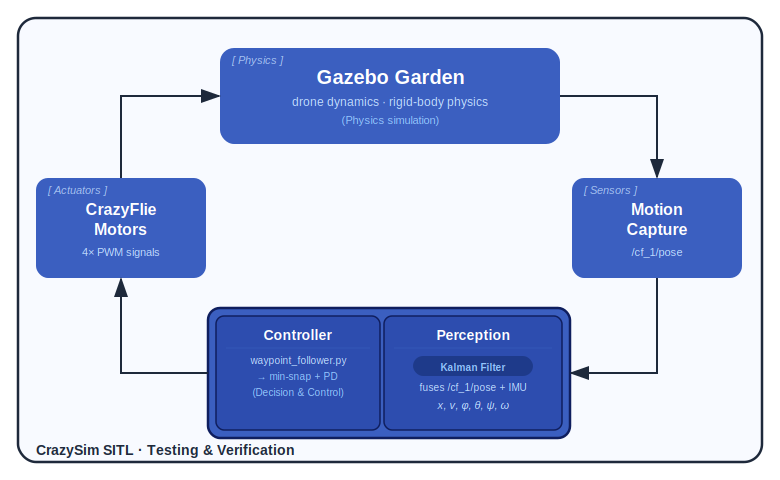
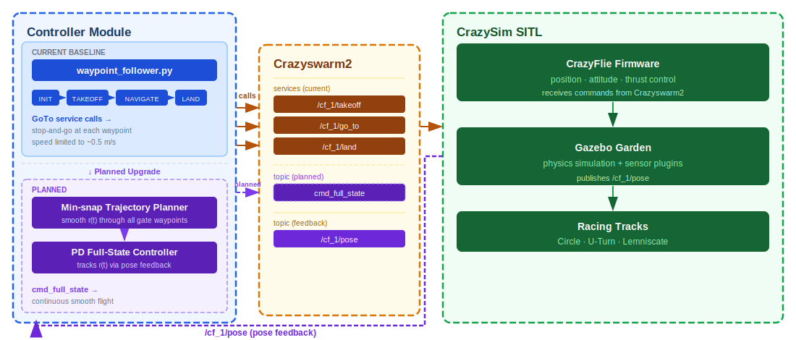
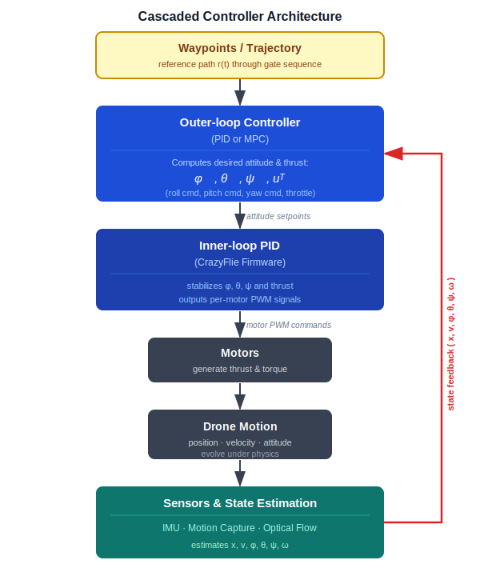

::: {.hero-section}

# Autonomous CrazyFlie Drone Racing {.title}

::: {.subtitle}
Software-in-the-loop simulation of gate-traversal drone racing using CrazySim, Gazebo, and ROS2
:::

::: {.author-list}

[**Yafu Xiao**](https://github.com/tonyxiao501),
[**Siyuan Gong**](https://gooosy.github.io),
[**Anay Koorapaty**](anayk3@illinois.edu)

:::

::: {.affiliation-list}

University of Illinois at Urbana-Champaign,  ECE 484

:::

::: {.button-row}
[[ Code]{.btn-text}](https://github.com/safeautonomy-illinois-students/project-site-safeset2-0){.btn .btn-primary}

<!-- [[ Paper]{.btn-text}](https://arxiv.org/pdf/XXXX.XXXXX){.btn .btn-primary} -->
<!-- [[ arXiv]{.btn-text}](https://arxiv.org/abs/XXXX.XXXXX){.btn .btn-primary} -->
<!-- [[ Video]{.btn-text}](https://www.youtube.com/watch?v=cSQTZoZPJzs){.btn .btn-primary} -->
<!-- [[ Code]{.btn-text}](https://github.com/){.btn .btn-primary} -->
<!-- [[ Data]{.btn-text}](https://example.com){.btn .btn-primary} -->

:::

:::


<!-- ============================================================ -->
<!-- TEASER IMAGE / VIDEO -->
<!-- ============================================================ -->

::: {.section-container}

::: {.hero-teaser}
{width=100% fig-align="center"}
{width=100% fig-align="center"}
:::

:::


<!-- ============================================================ -->
<!-- ABSTRACT -->
<!-- ============================================================ -->

::: {.section-container}

## Abstract {.section-title}

::: {.abstract-text}
We want to build controllers that enable a quadrotor to reliably navigate through a sequence of racing gates within the photorealistic FalconGym simulation environment.
We build an autonomous flight stack for the **CrazyFlie 2.1** that races through gates entirely in
simulation. The platform is **CrazySim** + **Gazebo Garden** + **ROS2**, running the actual CrazyFlie
firmware — so anything we prove in sim can transfer to real hardware. Three tracks are available:
**Circle**, **U-turn**, and **Lemniscate**, each with physical gate obstacles.

Current baseline is a stop-and-go waypoint follower (`waypoint_follower.py`) that calls `GoTo` with
pre-known gate coordinates — functional, but slow and jerky. Our main goal is to build and compare
better controllers: starting with a **minimum-snap trajectory tracker** paired with a PD full-state
feedback loop, then working toward non-linear SO(3) control and part-by-part trajectory fitting that
pushes the drone to its physical speed limit. On the perception side, we plan to use a **Kalman filter** to
fuse noisy pose and IMU readings into a clean state estimate (position, velocity, attitude, angular
rate), which feeds directly into the controller. We benchmark each method across all three tracks by
**lap time** and **gate-miss rate**, testing both longitudinal and lateral control strategies.
:::

:::


<!-- ============================================================ -->
<!-- APPROACH -->
<!-- ============================================================ -->

::: {.section-container}

## Approach {.section-title}

::: {.content-text}

### Problem Statement
Given a pre-defined racing track with physical gates and a knowledge of waypoints that could lead the drone to cross the the gates and the knowledge of the world coordnate of the drone itself through motion capture, command a CrazyFlie 2.1 to autonomously take off, fly through every gate in order, and land — with no human intervention.

### Simulation Environment
We use **CrazySim** (ICRA 2024) as our SITL platform. It compiles the real CrazyFlie firmware
to run on a desktop, while Gazebo Garden provides physics and sensor simulation. The simulated
drone communicates over UDP with **crazyflie-lib-python (cflib)**, and **Crazyswarm2** provides
a ROS 2 abstraction layer exposing standard services (`Takeoff`, `Land`, `GoTo`) and topics
(`/cf_1/pose`).

### Sensors / Information Used

| Signal | Source | Topic / Interface |
|---|---|---|
| 6-DOF pose (position + orientation) | Gazebo motion-capture plugin | `/cf_1/pose` (PoseStamped) |
| Gate positions | Known from track SDF world files | Hard-coded / map |

The drone currently relies entirely on **pose feedback** from the simulated motion-capture system.
No onboard camera or LIDAR is used at this stage.

### Controller Architecture

The current baseline is a **waypoint follower** implemented as a ROS 2 node
(`WaypointControllerNode`). It operates as a state machine:

```
INIT → TAKEOFF → NAVIGATE (waypoint-by-waypoint) → LAND → DONE
```

At each step the node calls the Crazyswarm2 `GoTo` service, which handles low-level
position control, altitude hold, and trajectory smoothing inside the CrazyFlie firmware.
Waypoint arrival is detected when the XY distance to the target drops below 0.3 m.


### Planned Extensions
- Quantization of robustness and stability analysis through measuring lap time and gate-miss rate as quantitative metrics
- Set waypoints for the other two tracks, U-Turn and Lemniscate tracks.
- Implement a controller beyond the one beyond firmware burnt-in one. Create fine-grained controller aside from just going to the next waypoint in a rough and sparse set of waypoints with constant speed. 
We would want to have this project working just like MP2, but in SO(3). Test and compare between different longitudial and lateral controlling methods and compare the achievalbe speed of each of them through profilling the drone's internal sensors across all three tracks.
- Advanced non-linear longitudial control of speed concerning SO(3) parameters
- Advanced lateral control concerning rotation with repsect to all three rotation matrices.
- Advanced part by part trojectory fitting by modeling the physically optimal trajectories that the drone could fly in highest speed and try to fit these partterns into the real world waypoints to achieve this speed
- If camera available: CV based pixel to world coordinates regression and then get rid of the knowledge of the knowledge on the current world coordinates of the drone(I.e., get rid of the motion capture system), but since we do not have access to any cameras, this is just a proposal

:::

:::


<!-- ============================================================ -->
<!-- OVERVIEW / METHOD VIDEO -->
<!-- ============================================================ -->

::: {.section-container}

## Video {.section-title}

::: {.video-container}
<!-- Replace with your local video embed -->

:::


:::


<!-- ============================================================ -->
<!-- RESULTS GALLERY -->
<!-- ============================================================ -->

<!-- 
::: {.section-container}

## Results {.section-title}

::: {.content-text}
Provide a brief description of the results shown below. Explain what the
reader should observe and why it matters.
:::

::: {.results-grid}

::: {.result-card}

:::

::: {.result-card}

:::

::: {.result-card}

:::

:::

:::
-->

<!-- ============================================================ -->
<!-- QUALITATIVE COMPARISONS -->
<!-- ============================================================ -->
<!-- 
::: {.section-container}

## Qualitative Comparisons {.section-title}

::: {.content-text}
Describe the comparison setup — which baselines are you comparing against, and
what should the reader look for in the side-by-side results.
:::

::: {.comparison-grid}

::: {.comparison-item}


**Ours**
:::

::: {.comparison-item}


**Baseline A**
:::

:::

:::
-->

<!-- ============================================================ -->
<!-- INTERACTIVE SLIDER (Optional) -->
<!-- ============================================================ -->

<!-- 
::: {.section-container}

## Interpolation Demo {.section-title}

::: {.content-text}
If your method supports interpolation or continuous control, you can add an
interactive slider here. The example below shows how to set one up.
:::

::: {.interpolation-panel}

::: {.interpolation-endpoints}
{.endpoint-img}

{.endpoint-img}
:::

<input type="range" min="0" max="100" value="50" class="interpolation-slider" id="interpolation-slider">
<div id="interpolation-value" class="interpolation-value">50%</div>

<script>
  const slider = document.getElementById('interpolation-slider');
  const display = document.getElementById('interpolation-value');
  slider.addEventListener('input', function() {
    display.textContent = this.value + '%';
  });
</script>

:::

:::
-->

<!-- ============================================================ -->
<!-- RELATED WORK -->
<!-- ============================================================ -->

::: {.section-container}

## Related Work {.section-title}

::: {.content-text}

Here are some related works in this area:

- [Crazyswarm2 Code Repository](https://github.com/IMRCLab/crazyswarm2) provides a ROS2-based framework for controlling and coordinating Crazyflie quadrotor swarms.
- [Related Paper 1](https://arxiv.org/abs/1003.2005) proposes a geometric control method for stable trajectory tracking of quadrotor UAVs.
- [Related Paper 2](https://arxiv.org/abs/1811.08027) introduces a learning-based controller that models aerodynamic effects to improve drone landing stability.

Check out [this survey](https://ieeexplore.ieee.org/document/8827409/) for a comprehensive overview of quadrotor control methods.
:::

:::


<!-- ============================================================ -->
<!-- BIBTEX -->
<!-- ============================================================ -->

::: {.section-container}

## BibTeX {.section-title}

```bibtex
@misc{crazyswarm2,
  title={Crazyswarm2: ROS2-based swarm control for Crazyflie},
  author={IMRCLab},
  year={2023},
  howpublished={\url{https://github.com/IMRCLab/crazyswarm2}}
}
```
```bibtex
@misc{lee2011controlcomplexmaneuversquadrotor,
      title={Control of Complex Maneuvers for a Quadrotor UAV using Geometric Methods on SE(3)}, 
      author={Taeyoung Lee and Melvin Leok and N. Harris McClamroch},
      year={2011},
      eprint={1003.2005},
      archivePrefix={arXiv},
      primaryClass={math.OC},
      url={https://arxiv.org/abs/1003.2005}, 
}
```
```bibtex
@ARTICLE{8827409,
  author={Kim, Jinho and Gadsden, S. Andrew and Wilkerson, Stephen A.},
  journal={Canadian Journal of Electrical and Computer Engineering}, 
  title={A Comprehensive Survey of Control Strategies for Autonomous Quadrotors}, 
  year={2020},
  volume={43},
  number={1},
  pages={3-16},
  keywords={Rotors;Unmanned aerial vehicles;Aircraft propulsion;Military aircraft;Helicopters;Control systems;Autonomous;control;quadrotor;unmanned aerial vehicle (UAV);unmanned aircraft system (UAS)},
  doi={10.1109/CJECE.2019.2920938}}
```
```bibtex
@inproceedings{Shi_2019,
   title={Neural Lander: Stable Drone Landing Control Using Learned Dynamics},
   url={http://dx.doi.org/10.1109/ICRA.2019.8794351},
   DOI={10.1109/icra.2019.8794351},
   booktitle={2019 International Conference on Robotics and Automation (ICRA)},
   publisher={IEEE},
   author={Shi, Guanya and Shi, Xichen and O’Connell, Michael and Yu, Rose and Azizzadenesheli, Kamyar and Anandkumar, Animashree and Yue, Yisong and Chung, Soon-Jo},
   year={2019},
   month=may, pages={9784–9790} }
```
:::


<!-- ============================================================ -->
<!-- FOOTER -->
<!-- ============================================================ -->

::: {.site-footer}

This website template is adapted from the
[Nerfies](https://nerfies.github.io) project page, which is licensed under a
[Creative Commons Attribution-ShareAlike 4.0 International License](http://creativecommons.org/licenses/by-sa/4.0/).

:::
